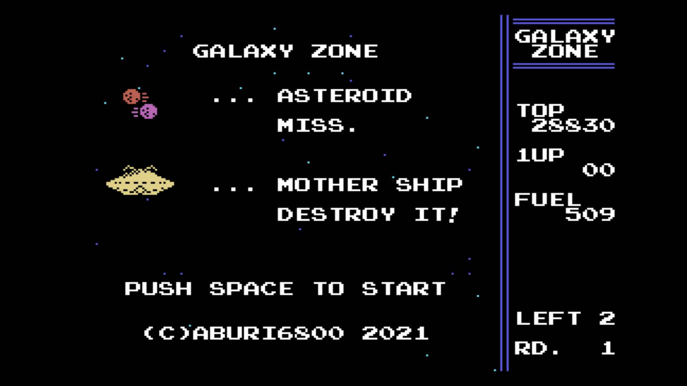
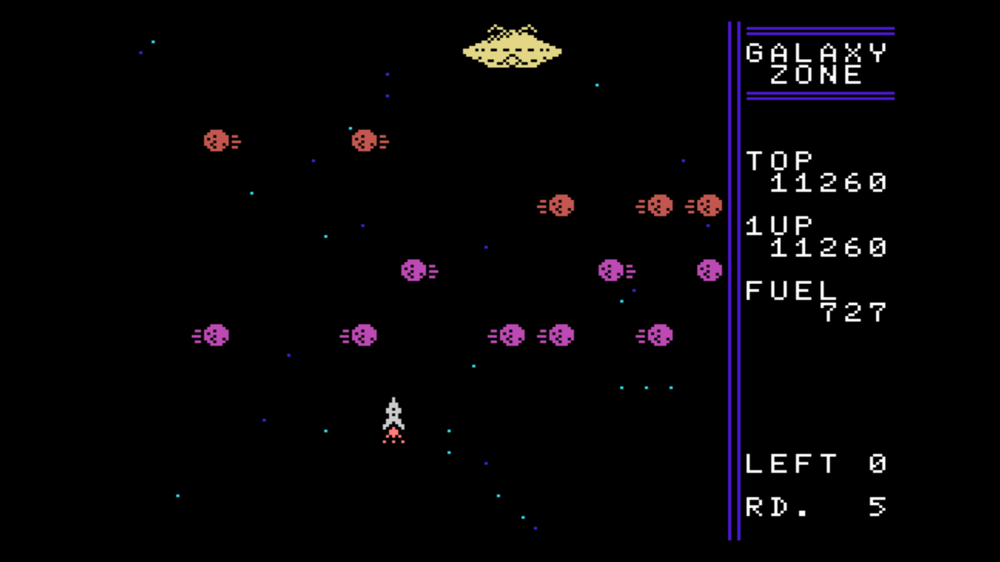

[ [Engligh](README.md) | [日本語](README_ja.md) ]

---
# MSX-GalaxyZone

## 概要

ミサイルを操作して小惑星を避け、エイリアンの母船に命中させるゲームです。  
MSX-BASICで作成しています。  

## 要件

- MSX/2/2+/TurboR  

## WebMSXでの実行

- 以下のURLにアクセスしてください。  

https://webmsx.org/?MACHINE=MSX1J&DISKA_URL=https://github.com/aburi6800/MSX-GalaxyZone/raw/master/GalaxyZone.dsk&FAST_BOOT

## How to play

- ミサイルを操作して、エイリアンの母船を破壊しましょう。
- ミサイルが小惑星に当たったり、燃料がなくなったり、ミサイルが外れたりすると失敗となります。
- 3回失敗するとゲームオーバーになります。

## 操作方法

- カーソルキー or コントロールパッド : ミサイル移動
- スペースキー or トリガボタン : ゲームスタート, ミサイル前進

## ライセンス

- MITライセンスとします。  
ソフトウェアは自由に扱って構いませんが、再頒布時に著作権表示とライセンス表示を含めてください。 また、作者や著作権者はいかなる責任も負いません。
